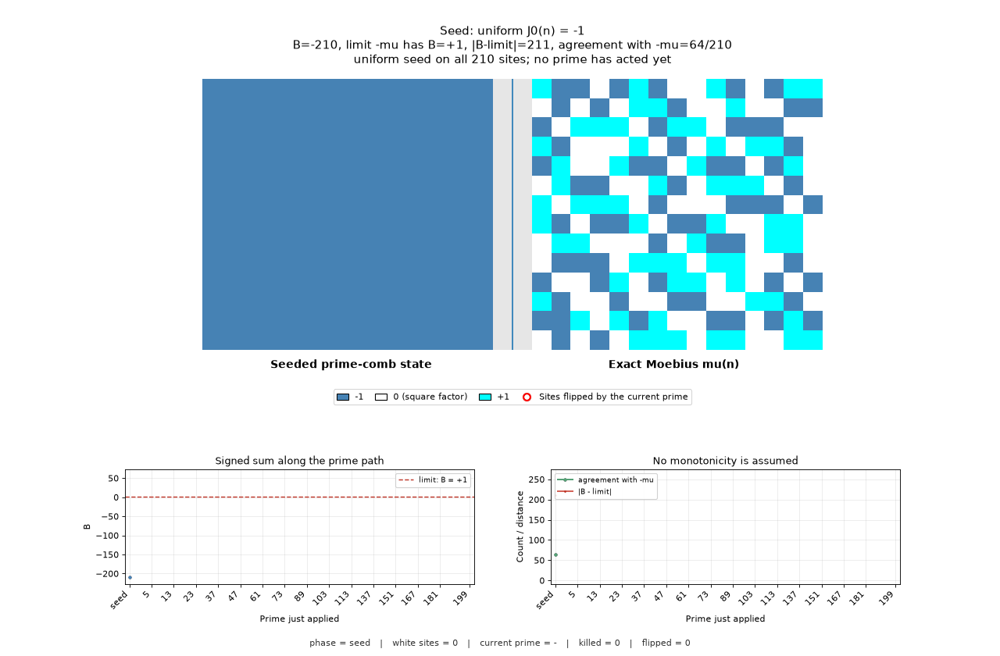

# Prime-Wheel Möbius

Public companion repository for **Seeded Prime-Comb Dynamics and the Finite Harmonic Reduction of Primorial-Block Möbius Sums**.

## Visualization

An exact deterministic reconstruction of the Möbius field on the fourth primorial block

```math
W_4 = 2\cdot 3\cdot 5\cdot 7 = 210.
```

The left panel evolves prime by prime; the right panel is the fixed target $\mu(n)$.

<p align="center">
  
</p>

### Construction

Initialize the prime-candidate field by

```math
J_0(1)=+1,
\qquad
J_0(n)=-1 \quad (2\le n\le W_4).
```

An untouched value $-1$ means that no smaller proper prime divisor has acted on the site, so the site remains a prime candidate.

Process each prime

```math
p\le \left\lfloor\frac{W_4}{2}\right\rfloor=105
```

exactly once, in increasing order. A prime never acts on itself. It acts only on its proper multiples

```math
2p,3p,\ldots,
\left\lfloor\frac{W_4}{p}\right\rfloor p.
```

For each proper multiple $n$ of the current prime $p$:

1. If $p^2\mid n$, set $J(n)=0$ permanently.
2. Otherwise, if the site already has an admitted distinct prime divisor, reverse its sign.
3. Record internally that $p$ is now an admitted proper divisor of the site.

Only actual sign reversals are displayed, under the label **Prime hit (sign flip)**. The internal divisor bookkeeping is not displayed as a separate event. The seed supplies the initial negative sign, and each additional distinct prime divisor reverses it.

White sites are not initialized. They are created by the square-factor rule, and since $0$ is absorbing, no later prime can revive one. After the last prime with $p^2\le W_4$, the support is frozen and equals the squarefree set. For $W_4=210$, that prime is $13$.

There are $27$ active primes $p\le105$. The six primes

```math
2,3,5,7,11,13
```

can both create white sites and produce sign flips. The other $21$ active primes can only produce sign flips. Every prime $p>105$ is exactly inert because its first proper multiple $2p$ lies outside the block.

### Terminal state

After every active prime $p\le\lfloor W/2\rfloor$ has acted,

```math
J(n)=\mu(n)
\qquad (1\le n\le W),
```

and therefore

```math
B=\sum_{n\le W}J(n)=M(W).
```

Indeed, every composite $n\le W$ has a proper prime divisor at most $n/2\le W/2$. Primes greater than $W/2$ have no proper multiples in the block and remain untouched at their correct Möbius value $-1$.

For $W_4=210$, the final active prime is $103$ and

```math
B=M(210)=-1.
```

### Endpoint alignment

Let $q_1(y)$ be the least prime greater than $y$. After all primes $p\le y$ have acted through their proper multiples, the reconstruction agrees with $\mu$ at

```math
\text{every } n<2q_1(y).
```

The first possible failure is

```math
n=2q_1(y),
```

because the smaller factor $2$ has acted while the new prime $q_1(y)$ has not.

For a completed block, take

```math
y=\left\lfloor\frac W2\right\rfloor.
```

Then $q_1(y)>W/2$, so $2q_1(y)>W$ and the entire block is reconstructed exactly. Endpoint agreement is therefore forced by the cutoff; it is not evidence for a bound on $M(W)$ as $W$ varies.

### The path

The endpoint is pinned, but the route to it is the finite object displayed by the animation. Each active prime moves the signed sum by

```math
B_j=B_{j-1}-K_j-2C_j,
```

where $K_j$ is the signed mass carried by the square-kill channel and $C_j$ is the signed mass carried by the **Prime hit (sign flip)** channel immediately before the $j$-th prime acts. Killed sites lose their mass outright, while sign-flipped sites reverse theirs.

Once $p_j^2>W$, the kill channel is empty and

```math
B_j=B_{j-1}-2C_j.
```

More precisely, for

```math
\sqrt W<p\le \frac W2,
```

write

```math
K=\left\lfloor\frac Wp\right\rfloor.
```

The proper multiples touched by $p$ are $kp$ for $2\le k\le K$, and immediately before $p$ acts their states are $\mu(k)$. Hence

```math
C_p=\sum_{k=2}^{K}\mu(k)=M(K)-1,
```

so

```math
\Delta B_p
=-2C_p
=2\left(1-M\!\left(\left\lfloor\frac Wp\right\rfloor\right)\right).
```

For $p>W/2$, the proper-multiple channel is empty and $\Delta B_p=0$.

For $W_4=210$, the corrected path is strictly monotone increasing:

| after active prime | $B$ | distance to $M(210)$ | sites agreeing with $\mu$ |
|---|---:|---:|---:|
| seed | $-208$ | $207$ | $66$ |
| $2$ | $-156$ | $155$ | $118$ |
| $13$ | $-81$ | $80$ | $156$ |
| $67$ | $-17$ | $16$ | $202$ |
| $103$ | $-1$ | $0$ | $210$ |

Every active-prime increment in this displayed block is positive. This finite monotonicity does not by itself control the endpoint $M(W)$ as the wheel size varies.

Final inventory, with the $81$ white sites contributing nothing:

```math
Q(210)=129,
\qquad
N_+(210)=64,
\qquad
N_-(210)=65,
\qquad
M(210)=-1.
```

## What has to be bounded

The lower-left curve is the exact finite prime-comb path

```math
B_J(y)=\sum_{n\le W}J_y(n),
```

where $J_y$ is the prime-candidate state after the active primes up to $y$ have acted. Its endpoint is

```math
B_J\!\left(\left\lfloor\frac W2\right\rfloor\right)=M(W).
```

The two classical targets are statements about that endpoint as $W$ varies:

```math
\mathsf{PNT}\iff M(x)=o(x),
```

```math
\mathsf{RH}\iff
M(x)=O_\varepsilon\!\left(x^{1/2+\varepsilon}\right)
\quad\text{for every }\varepsilon>0.
```

The exact finite reconstruction settles neither, because the endpoint is forced by the arithmetic bookkeeping. The strict monotonicity visible at $W_4=210$ is a property of that finite path, not an asymptotic estimate.

The arbitrary-$x$ reduction below is the manuscript's existing smooth/rough auxiliary-field analysis.

## Bounding it for arbitrary $x$

Fix the seed $s=-1$ and take the cutoff $y$ free of $x$. With $r_y(n)=n/s_y(n)$ the rough part and

```math
A_y(x)=\sum_{n\le x}\sigma_y(n),
\qquad
C_y(x)=\sum_{\substack{n\le x\\ r_y(n)=1}}\sigma_y(n),
\qquad
D_y(x)=\sum_{\substack{n\le x\\ \Omega(r_y(n))\ge2}}
\sigma_y(n)\bigl(1+\mu(r_y(n))\bigr),
```

one has, for every real $x\ge1$ and every $y\ge1$,

```math
M(x)=A_y(x)-2C_y(x)-D_y(x).
```

This is a re-expression of

```math
\mu(n)=\mu(s_y(n))\,\mu(r_y(n))
```

and carries no arithmetic content by itself. Its use is that $D_y(x)=0$ exactly when $x<q_1(y)^2$, so on a completed wheel it reduces to the reconstruction above, and everywhere else it isolates the whole discrepancy.

Three quantities are unconditional and explicit for arbitrary $x$:

```math
\left|
A_y(x)+x\prod_{p\le y}\left(1-\frac1p\right)^2
\right|
\le 4^{\pi(y)},
```

```math
C_y(x)=0
\quad\text{for }x\ge\prod_{p\le y}p,
```

```math
\sum_{a\bmod Q(y)}\left|\widehat{\sigma_y}(a)\right|
=
\prod_{p\le y}2(p-1)(2p-1),
```

where the last sum is over the square-sensitive period

```math
Q(y)=\prod_{p\le y}p^2,
```

which is the wheel the auxiliary state is actually periodic under — not a primorial.

### The explicit target

Fix any $y\ge2$. Once

```math
x\ge\prod_{p\le y}p,
```

the smooth core is complete, $C_y(x)=0$, and both remaining errors are constants in $x$, so the identity collapses to

```math
M(x)+D_y(x)
=
-x\prod_{p\le y}\left(1-\frac1p\right)^2+O_y(1).
```

Therefore, for every fixed $y$,

```math
\mathsf{PNT}
\iff
D_y(x)
=
-x\prod_{p\le y}\left(1-\frac1p\right)^2+o(x),
```

```math
\mathsf{RH}
\iff
D_y(x)
=
-x\prod_{p\le y}\left(1-\frac1p\right)^2
+O_\varepsilon\!\left(x^{1/2+\varepsilon}\right).
```

So $D_y$ is not an error term waiting to be absorbed: it has to reproduce the seeded main term to within the target accuracy. At $x=10^6$ the ratio of $\max|D_y|$ to that main term is $1.001$ through $1.008$ for $y=2,\dots,17$.

### Why the regimes do not meet

| requirement | condition | threshold |
|---|---|---|
| reconstruction exact, $D_y=0$ | $q_1(y)^2>x$ | $y\asymp\sqrt{x}$ |
| wheel completable | $4^{\pi(y)}\le x$ | $y\asymp\log x\log\log x$ |
| smooth core complete, $C_y=0$ | $\prod_{p\le y}p\le x$ | $y\asymp\log x$ |

At $x=10^6$ the largest completable cutoff is $y=23$ while the exact cutoff is $y=997$. The gap is exponential in $\pi(y)$, so sharpening the completion error does not close it. At the exact end $D_y$ vanishes but $A_y$ and $C_y$ are individually as deep as $M(x)$.

The construction redistributes the difficulty exactly. Bounding $D_y$ for

```math
\log x<y<\sqrt{x}
```

is the open problem.

## Contents

* `paper/` — manuscript source and build notes.
* `formalization/` — standalone Lean 4 project pinned to Lean/mathlib `v4.24.0`.
* `numerics/` — finite primorial-block validation, exact reconstruction programs, and analytic falsification gates.
* `docs/` — theorem status, source provenance, and publication checklist.
* `.github/workflows/` — Lean verification and numerical reproducibility.

## Mathematical boundary

The formalization proves the exact chain

```text
explicit pinned Dirichlet estimate
<-> harmonic nonconcentration
<-> finite wheel residual bound
<-> global Mertens-energy bound.
```

It does **not** claim an unconditional proof of the Riemann Hypothesis. Two inputs remain explicit: the maximal pinned Dirichlet/nonconcentration estimate, and the classical theorem connecting the stated Mertens-energy bound to Mathlib's Riemann Hypothesis proposition.

The visualization is an exact finite reconstruction of $\mu$ and nothing more. On $W_4=210$ its intermediate signed sums are strictly monotone, but that finite fact does not establish $M(X)=o(X)$ or an RH-scale estimate as $X$ varies. Endpoint agreement is forced by the cutoff, and the identities above are exact but tautological — each re-expresses the target rather than reducing it.

See [`docs/THEOREM_STATUS.md`](docs/THEOREM_STATUS.md).

## Lean build

```bash
cd formalization
lake update
lake build RHLean --wfail
bash scripts/audit_assumptions.sh
```

## Paper

Compiled manuscript: [`paper/seeded_prime_comb_harmonic_reduction.pdf`](paper/seeded_prime_comb_harmonic_reduction.pdf) — source [`paper/seeded_prime_comb_harmonic_reduction.tex`](paper/seeded_prime_comb_harmonic_reduction.tex).

## Numerical reproduction

```bash
python3 numerics/primorial_block_validation.py
python3 numerics/prime_comb_viz.py --limit 210 --output-dir numerics
```

See [`numerics/README.md`](numerics/README.md) for exact commands, status boundaries, generated artifacts, and hash manifests.

## License

Lean and Python source in this repository is licensed under the Apache License,
Version 2.0; see [LICENSE](LICENSE).

The manuscript under `paper/` is licensed under the Creative Commons Attribution
4.0 International License (CC BY 4.0); see [paper/LICENSE](paper/LICENSE).
